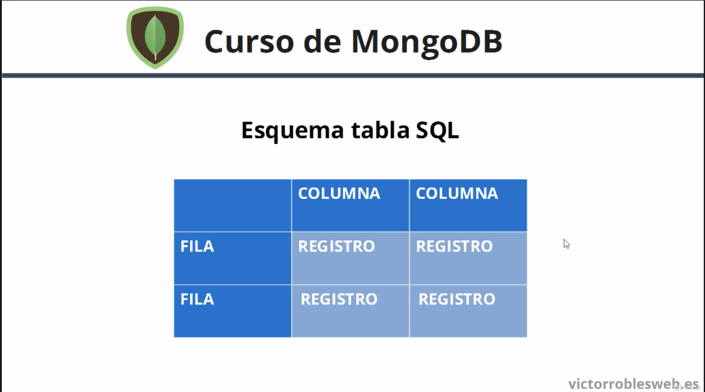
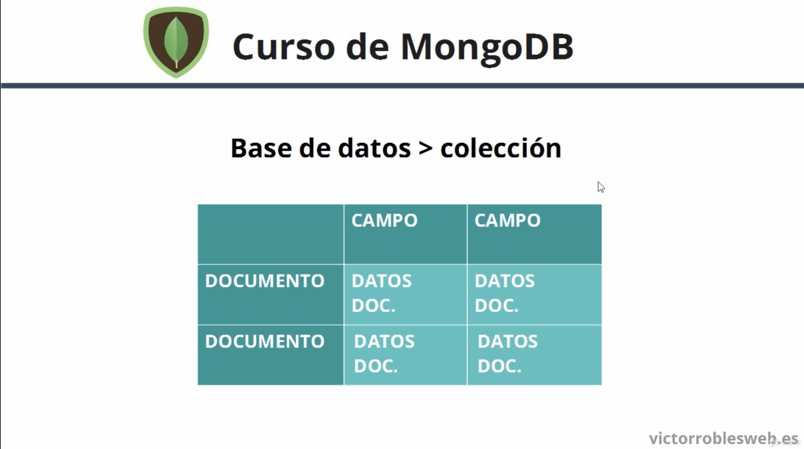

# Teoria de Bases de Datos

### Tipos de Bases de Datos

1. SQL:
- Relacionales
- Tablas
- Esquemas

2. NoSQL
- No relacionales
- Javascript
- Orientada a Documentos (JSON, BSON)
- Sencillez
- Velocidad
- Esquema Libre

